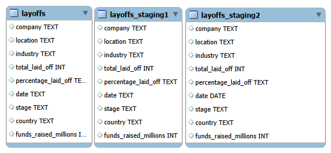

# 📉 World Layoffs: Data Cleaning & Exploratory Analysis

This project is part of my SQL Sandbox, where I tackle real-world datasets to demonstrate end-to-end data processing.

## 🗺️ Database Schema (ERD)

## 🛠️ Phase 1: Data Cleaning

* Staging Environments: Created layoffs_staging1 and layoffs_staging2.
* Duplicate Removal: Utilized ROW_NUMBER() over a PARTITION.
* Standardization:
  * Cleaned company names using TRIM().
  * Unified "Crypto" industry labels.
  * Normalized "United States" country names.
* Date Formatting: Converted TEXT to DATE using STR_TO_DATE().
* Null Value Logic: Employed a Self-Join to populate missing industry data.

# 📈 Phase 2: Exploratory Data Analysis
* Market Leaders: Identified companies with the highest total layoffs.
* Industry Trends: Focused on Consumer and Retail sector impacts.
* Time-Series: Created a Rolling Total of layoffs by month.
* Rankings: Used DENSE_RANK() to find the top 5 companies per year.

# 💻 Featured Query: Rolling Total
This query uses a CTE and a Window Function to track layoffs over time.

SQL
WITH Rolling_Total AS (
    SELECT SUBSTRING(`date`, 1, 7) AS `MONTH`, SUM(total_laid_off) AS total_off
    FROM layoffs_staging2
    WHERE SUBSTRING(`date`, 1, 7) IS NOT NULL
    GROUP BY `MONTH`
    ORDER BY 1 ASC
)
SELECT `MONTH`, total_off,
SUM(total_off) OVER(ORDER BY `MONTH`) AS rolling_total
FROM Rolling_Total;
